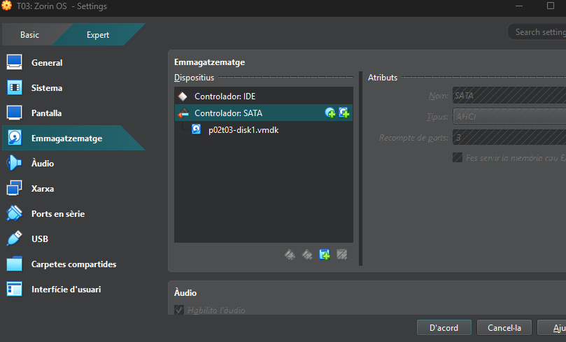
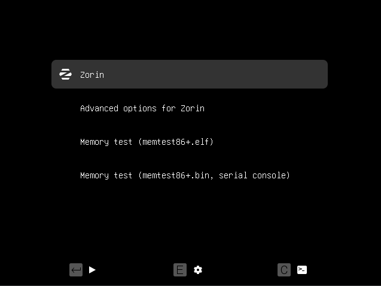
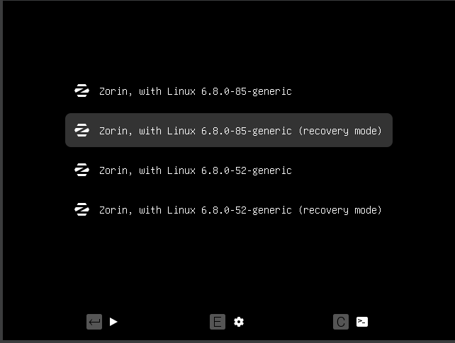
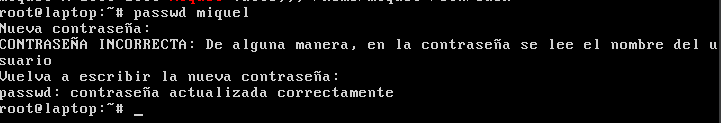
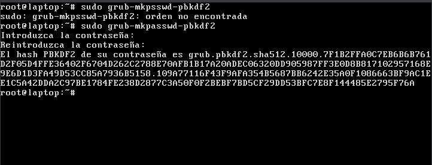
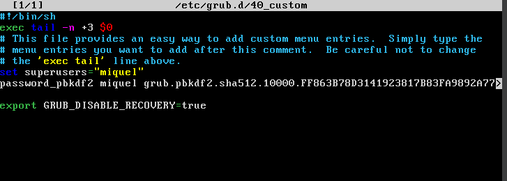
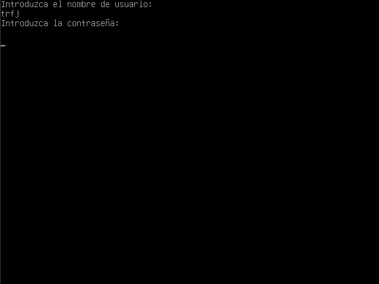

# T03: Seguretat Lògica — Recuperant accés a sistemes

Després de la primera feina exitosa, us arriba un encàrrec urgent que obliga a que us hi poseu per donar-li solució.  
Com a fase prèvia rebreu una formació sobre la seguretat lògica que us permetrà tenir els coneixements necessaris per afrontar la tasca.

Han arribat a la consultora un equip provinent d’un client que demana que els hi solucionem el problema.  
Tenen un portàtil amb Zorin OS (un Linux amb entorn gràfic) que usava habitualment un directiu. El problema és que ha oblidat la contrasenya i és necessari poder recuperar l’accés perquè hi ha documentació molt important que cal recuperar.  
Per evitar que una acció catastròfica pugui danyar l’equip original, ens han clonat el disc en un disc virtual perquè hi treballeu.


El primer pas serà crear una màquina virtual al que connectareu aquest disc.  
A continuació, cal que entreu a la màquina virtual, trobeu el nom de l’usuari existent i assigneu-li una contrasenya nova.

Quan el client és informat del senzill que és accedir a l’equip, demana si n’hi ha alguna manera de fortificar el sistema, ja que té por que si algú roba el portàtil hi pugui accedir a la informació que hi conté.  
Per tant, ara ens demanen que cerquem solucions per tal d’evitar que es pugui reiniciar la contrasenya amb el procediment anterior.  
Investigueu el procediment per tal que l’accés al GRUB quedi protegit per contrasenya per evitar canvis de configuració.

---

## Part 1: Entrar al sistema sense contrasenya

1. **Posem el disc en una màquina virtual i l’iniciem.**
   


3. **Veiem que no sabem la contrasenya de l’usuari.**
   


5. **Per poder canviar-li la contrasenya només haurem de reiniciar i, quan s’iniciï, mantenir premuda la tecla `Shift` (o alguna altra tecla) per entrar al menú d’arrencada (GRUB).**
   


7. **Anem a _Advanced options for Zorin_ i ens sortirà una llista de versions de Linux. Triem qualsevol versió que indiqui `(recovery mode)`.**
   


9. **Ja a la terminal hem d'esbrinar quin usuari és el del client, que es deia _Miquel Valls_ en Zorin. Per fer-ho, només cal executar:**
    ```bash
    cat /etc/passwd | grep Miquel
    ```
    


6. **Un cop saps quin és l’usuari, només cal canviar-li la contrasenya amb la comanda:**
    ```bash
    passwd miquel
    ```
    **Posa la nova contrasenya i reinicia.**
   


8. **I ja estaria 👍**
   


---

## Part 2: Protegeix el teu sistema

Encara que la protecció absoluta no existeix, sí que es pot millorar bastant.  
Per exemple, es pot posar una contrasenya al GRUB perquè no s’hi pugui entrar sense contrasenya.

1. **Dins del GRUB, posa la següent comanda:**
    ```bash
    sudo grub-mkpasswd-pbkdf2
    ```
    Et demanarà que posis una contrasenya i et retornarà la mateixa però en format hash.
   


3. **També pots fer:**
    ```bash
    grub-mkpasswd-pbkdf2 | tee root/passwd.txt
    ```
    per transferir el resultat de la comanda a un arxiu de text, ja que més endavant podrem utilitzar el multibuffer.

4. **Després haurem d’obrir un arxiu amb:**
    ```bash
    nano /etc/grub.d/40.custom
    ```
    i modificar-lo de la manera següent:
    ```
    set superusers="usuari_exemple"
    password_pbkdf2 usuari_exemple hash.exemple
    ```

    - Si heu fet la comanda `tee`, afegiu-li a la comanda nano l’opció `-F` per activar el multibuffer.
    - Amb `Ctrl+R` pots buscar l’arxiu.
    - Quan tinguis l’arxiu obert, amb `Alt+A` pots marcar la pauta per seleccionar. Un cop seleccionat tot, prem `Alt+6` per copiar, i després `Ctrl+X` per tancar l’arxiu que has obert amb `tee`.
    - Per enganxar el que has copiat, usa `Ctrl+U`.
  


5. **Per guardar els canvis que hem fet, només cal executar la següent comanda:**
    ```bash
    sudo grub-mkconfig -o /boot/grub/grub.cfg
    ```
    i després reiniciar l’ordinador.

6. **I ja estaria 👍**
   


- [Tornar: README.md](README.md)
